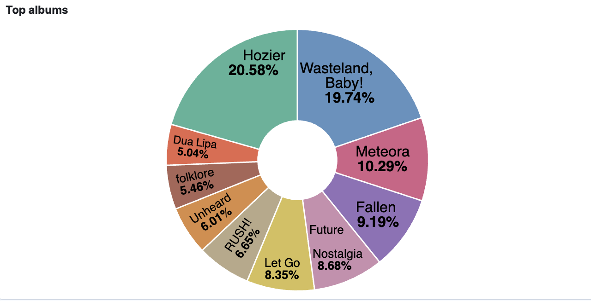

I am probably not the only one who was a little dissapointed by the Spotify Wrapped this year (and the internet seems to agrees). Looking back at our yearly musical history has become a highly anticipated moment of the year for heavy Spotify users. However, at the end of the day all "Wrapped" is, is a data analytics problem, with a great PR team. So perhaps the mantle must fall on fellow data analysis to attempt and solve this problem in a more satisfying way. 

With the back-to-work and brand-new-year motivation fueling us - let's see if we can do any better. (spoiler alert: definetely!)

### Getting your listening data 

The best part about this exercist is that it's fully replicatable. Spotify allows users [to download their own historical streaming data](https://support.spotify.com/uk/article/understanding-my-data/), which you can request out of your account settings.
Once this has been generated we can dive into years worth of data and start building our own fun dashboards.


Historical data will be generated as a list of JSON documents, each of them representing an action - in most cases a song that you've listened to with some additional metadata such as length of time in miliseconds, artist information, as well as device properties. Naturally, if you have any experience with Elastic, the first thought looking at this data would be that this data practically screams "add me to an index and search me!". So we will do just that.

### Building an Elasticsearch Index

As you can see in [this notebook]() once we've connected to our prefered Elasticsearch client, it takes a few simple lines of code to send the json documetns into a new index:
```python
def generate_docs(DATASET_PATH):
    with open(DATASET_PATH, "r") as f:
        json_data = json.load(f)
        documents = []
        for doc in json_data:
            documents.append(doc)
        load = helpers.bulk(client, documents, index=index_name)
```

Even the mapping is handleled automatically due to the high quality and consistency of the data as prepared by Spotify. One key element to pay attention to is to ensure fields like "Artist Name" are seen as `keywords` which will allow us to run more complex aggregations for our dashboards.

### Wrapping Queries

With the index fully populated we can explore the data throuhg code to run a few simple test queries. My top artist has been Hozier for quite a few years now, so I start with the simples possible term query to check my data:

```python

index_name = 'spotify-history'
query={
    "match": {
        "master_metadata_album_artist_name": "Hozier"
    }
}

response = client.search(index=index_name, query=query, size=3)

print("We get back {total} results, here are the first ones:".format(total=response["hits"]['total']['value']))
for hit in response["hits"]["hits"]:
    print(hit['_source']["master_metadata_track_name"])
```

This gives me back 5653 hits - which means I've played more than 5 thousands Hozier songs since 2015 (as far as my data goes back). Seems pretty accurate. 

Now we can continue to build more complex queries via code (or equivalent queries we can test with tools like the Dev Console). 

Like the most aticipated question - is my top artist list in Wrapped accurate? 
You can see in this notebook how we can build aggregations in our query to see the top artists. 

We can run this by either number of hits (how many songs have been played) or perhaps more accurately, by summing up the total number of miliseconds of playtime by artist bucket.


[See some great content on aggregation](https://opster.com/guides/elasticsearch/search-apis/elasticsearch-filter-aggregation/) @elisheva - should this be an elasticsearch link instead? opster had some awesome content on this.

### Building Dashboards

After these few examples we should have a good understanding on the Elasticsearc mechanics we can use to drill into this data. However, to both save time and make the insights more consumable (and pretty) we can also build a lot of these insights directly in a Kibana dashboard. 
Moving to my cloud Elastic cluster I've built a data view from my index and I can now directly build visualizations by dragging my data fields and choosing view types.

Within a few hours we have Iulia's Version of Spotify Wrapped, going deeper than ever before. Let's take a look.


Starting with the "classic" wrapped insights - we can easily build the top artist and song rank.

However, we can go further by adding more metadata like time or location and looking at how these trends have changed over the year. 


Here we can see the listening time over the year (in weekly buckets), the locations I've been listening from while traveling, and how my top artists have varied month by month (inclding a sighting of brat girl summer).
And this is only scratching the surface; I can already imagine for certain artists it would be interesting to look at different angles like Top album (or era). 



Just having the data stored in an index makes this a really fun and simple Elasticsearch usecase, really showcasing some of the coolest features like aggregations or custom dashboarding.

This already feels more interesting to look at than the simple ranking we got this year, so I will definetely re-run this script and dashboard with my Spotify data from now on - and feel free to try it out for yourself! 
