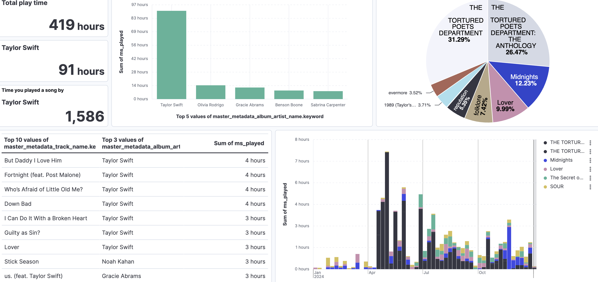

# Spotify Wrapped Iulia's Version.

I am probably not the only one who was a little dissapointed by the Spotify Wrapped this year (and the internet seems to agree). Looking back at our yearly musical history has become a highly anticipated moment of the year for heavy Spotify users. However, at the end of the day all "Wrapped" is, is a data analytics problem, with a great PR team. So perhaps the mantle must fall on fellow data analysts to attempt to solve this problem in a more satisfying way. 

With the back-to-work and brand-new-year motivation fueling us - let's see if we can do any better. (spoiler alert: definitely!)

### Getting your listening data 

The best part about this exercise is that it's fully replicable. Spotify allows users [to download their own historical streaming data via this link.](https://www.spotify.com/uk/account/privacy/), which you can request out of your account settings. If you want to generate your own version of this dashboard - request your own data to run this example through! Alternatively, you can try it out first on the sample data I've provided with a reduced sub-section from my own data.

Once this has been generated we can dive into years worth of data and start building our own fun dashboards. Check out [this notebook](/define_music_list.ipynb) for the code eamples.

Historical data will be generated as a list of JSON documents, each of them representing an action - in most cases a song that you've listened to with some additional metadata such as length of time in miliseconds, artist information, as well as device properties. Naturally, if you have any experience with Elastic, the first thought looking at this data would be that this data practically screams "add me to an index and search me!". So we will do just that.

### Building an Elasticsearch Index

As you can see in [the same notebook]() once you've connected to your preferred Elasticsearch client (in my case python, but any language client could be used), it takes a few simple lines of code to send the json documents into a new index:

```python
def generate_docs(DATASET_PATH):
    with open(DATASET_PATH, "r") as f:
        json_data = json.load(f)
        documents = []
        for doc in json_data:
            documents.append(doc)
        load = helpers.bulk(client, documents, index=index_name)
```

Even the mapping is handleled automatically due to the high quality and consistency of the data as prepared by Spotify. One key element to pay attention to is to ensure fields like "Artist Name" are seen as `keywords` which will allow us to run more complex aggregations for our dashboards.

### Wrapping Queries

With the index fully populated you can explore the data through code to run a few simple test queries. For example, my top artist has been Hozier for quite a few years now, so I start with the simplest possible term query to check my data:

```python

index_name = 'spotify-history'
query={
    "match": {
        "master_metadata_album_artist_name": "Hozier"
    }
}

response = client.search(index=index_name, query=query, size=3)

print("We get back {total} results, here are the first ones:".format(total=response["hits"]['total']['value']))
for hit in response["hits"]["hits"]:
    print(hit['_source']["master_metadata_track_name"])
```

This gives me back 5653 hits - which means I've played more than 5 thousand Hozier songs since 2015 (as far as my data goes back). Seems pretty accurate. You can run the same test, or query any of the other fields like `album name` or `song title` with a simple text match query. 

The next steps in [the notebook](/define_music_list.ipynb) are to build more complex queries, like the most anticipated question - is my top artist list in Wrapped accurate? 

You can calculate this by either number of hits (how many times songs have been played) or perhaps more accurately, by summing up the total number of milliseconds of playtime by artist bucket.


[You can read more about aggregations in elasticsearch here.](https://opster.com/guides/elasticsearch/search-apis/elasticsearch-filter-aggregation/) 

### Building Dashboards

After these few examples you should have a good understanding of the Elasticsearc mechanics you can use to drill into this data. However, to both save time and make the insights more consumable (and pretty) you can also build a lot of these insights directly in a Kibana dashboard. 

In my case, I've ran these in my cloud Elastic cluster but this can also be ran locally. You first need to [build a data view](https://www.elastic.co/guide/en/serverless/current/data-views.html) from the index and then you can directly build visualizations by dragging the data fields and choosing view types. Best part is - you can really make it your own by choosing the visualization type, date range you want to explore, which fields to showcase, etc.  

Within a few hours I build my own Spotify Wrapped - Iulia's Version, going deeper than ever before. Let's take a look.


Starting with the "classic" wrapped insights - I've first built the top artist and song rank.

Here's an example of how one of these graphs is built:


Looking at the points of interest in this graph if you want to recreate it:
* make sure to select the correct time interval for your data to cover 2024 in `1`
* choose to show the `top values` of the artist name field, and exclude the `other` bucket to make your visualization neat in `2`
* map this against the count of records to rank the artists based on how many times they appear in the data (equivalent to time the songs were played) in `3`


From here, I've gone even further by adding more metadata like time or location and looking at how these trends have changed throughout the year. Here you can see the listening time over the year (in weekly buckets), the locations I've been listening from while traveling, and how my top artists have varied month by month (including a sighting of brat summer).


Some more tricks worth noting for these graphs:
* when you work with the playing time instead of just count of records, you should choose to aggregate all the instances of a song or artist being played by using the `sum` function. This is the kibana equivalend to the `aggs` opertor we were using in the code in the first [notebook](/define_music_list.ipynb) examples.
* you can additionaly convert the milisecond into minutes or hours for neater visualiation
*you can layer as many field breakdowns as you want, like for example adding the `top 3 artists name` on top of the monthly aggregations. 


Comparing my final dashboard to my acutal Wrapped - it seems the results were close enough, but maybe not entierly accurate. It seems this year the top song choices are a little off from the way I calculate my ranking in this example. It could be that Spotify used a different formula to build this ranking, which makes it a bit harder to interpret. Thats's one of the benefits of building this dashboard from scratch - you have full transparancy on the type of aggregations and scoring used for your insights.


Finally, to really drive point the full customization benefit - I've had my colleague Elisheva also send me her own 2024 data. Here's another dashboard example, this time with a few more swifty insights:



This time I've highlighted the `albums` breakdown since it gives some cool "eras" insights' and added the "hours of playtime per album per month" - from which you can really pinpoint when Tortured Poets came out as an extra fun treat. 


Just having the data stored in an index makes this a really fun and simple Elasticsearch use case, really showcasing some of the coolest features like aggregations or custom visualizations - and I these examples insipire you to try our your very own search engine and personal dashboard! 


